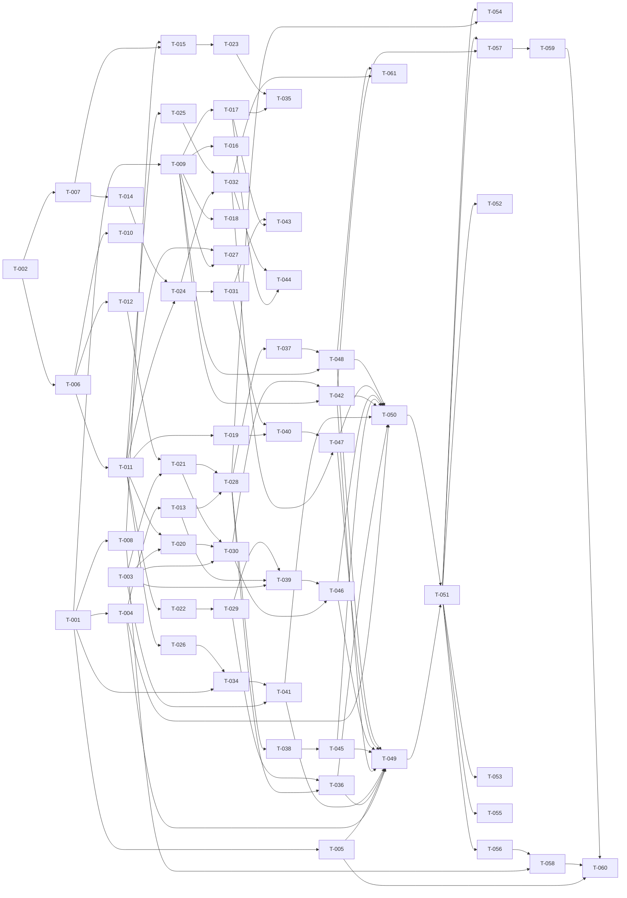

# Build Site

60 tasks across 13 tiers from 3 kits.

Cloud Radar (`io.github.alecszaharia.cloud-radar`) — Omarchy 4 bar-widget plugin. Greenfield: no source
exists yet. Runtime is QML/Quickshell under the Omarchy shell (`manifest.json` schemaVersion 1, root type
`BarWidget` in `BarWidget.qml`, nested `Panel` via `Loader`). Weather-data R3 (grid model) and R6 (status
enum) are the interface contract consumed by map-rendering; packaging R1 (manifest, `refreshMinutes`,
bar-widget entry point) unblocks both other domains.

## Tier 0 — No Dependencies

| Task | Title | Cavekit | Requirement | Effort |
|------|-------|---------|-------------|--------|
| T-001 | Repo scaffold, `manifest.json` identity block and `BarWidget.qml` entry point stub | plugin-packaging | R1 | M |
| T-002 | Grid constants module (bounds, columns, rows, spacing, center) readable without a fetch | weather-data | R1 | S |
| T-003 | Status enum type and observable status store with change notification | weather-data | R6 | S |

## Tier 1 — Depends on Tier 0

| Task | Title | Cavekit | Requirement | blockedBy | Effort |
|------|-------|---------|-------------|-----------|--------|
| T-004 | `refreshMinutes` settings-schema entry (integer 10–120, default 20) as the only setting | plugin-packaging | R1 | T-001 | S |
| T-005 | LICENSE file and matching manifest `license` field | plugin-packaging | R5 | T-001 | S |
| T-006 | Grid point generator: 109 deterministic cell-centre points (12×9 + exact center) | weather-data | R1 | T-002 | M |
| T-007 | Equirectangular projection function (bounds → map area, aspect preserved) | map-rendering | R1 | T-002 | M |
| T-008 | Bundled simplified outline dataset for the ten regions with recorded license | map-rendering | R2 | T-001 | M |
| T-009 | Popup chrome: nested `Panel` via `Loader`, open/close/toggle, `PanelKeyCatcher` Escape | map-rendering | R6 | T-001 | M |

## Tier 2 — Depends on Tier 1

| Task | Title | Cavekit | Requirement | blockedBy | Effort |
|------|-------|---------|-------------|-----------|--------|
| T-010 | Grid tiling and bounds-containment test suite (108 cells, no gaps or overlaps) | weather-data | R1 | T-006 | S |
| T-011 | Grid model type and happy-path normalizer (cells, center, `dataTime`, `fetchedAt`) | weather-data | R3 | T-006 | M |
| T-012 | Open-Meteo multi-point request builder (`current=cloud_cover,precipitation`, no key) | weather-data | R2 | T-006 | M |
| T-013 | `refreshMinutes` reader with clamping to 10–120 and default-20 fallback | weather-data | R4 | T-004 | S |
| T-014 | Cell-rectangle tiling from the projection and resize re-derivation | map-rendering | R1 | T-007 | M |
| T-015 | Basemap outline renderer with documented Moldova emphasis rule | map-rendering | R2 | T-007, T-008 | M |
| T-016 | Shell `summon`/`hide` IPC handling for the plugin id | map-rendering | R6 | T-009 | S |
| T-017 | Documented popup width constant and free-screen-area fit at 1280×720 | map-rendering | R6 | T-009 | S |
| T-018 | Popup theming bound to `barForeground` and `bar.fontFamily` | map-rendering | R6 | T-009 | S |

## Tier 3 — Depends on Tier 2

| Task | Title | Cavekit | Requirement | blockedBy | Effort |
|------|-------|---------|-------------|-----------|--------|
| T-019 | Unavailable-value normalization (dropped location, nulls, out-of-range → "unavailable") | weather-data | R3 | T-011 | M |
| T-020 | Unparseable-response handling: no new model, previous model preserved, `error` status | weather-data | R3 | T-011, T-003 | S |
| T-021 | Fetch executor: one outbound request per refresh, fixed timeout constant → `error` | weather-data | R2 | T-012, T-003 | M |
| T-022 | Cache writer under the user state directory with logged non-fatal write failure | weather-data | R5 | T-011 | M |
| T-023 | Chișinău marker at the projected center and label-free map surface | map-rendering | R2 | T-015 | S |
| T-024 | Cloud heatmap opacity ramp over a single documented neutral colour | map-rendering | R3 | T-014, T-011 | M |
| T-025 | Precipitation band thresholds: four total, gapless documented mm bands | map-rendering | R4 | T-011 | S |
| T-026 | Bar glyph mapping table with documented numeric thresholds for four conditions | map-rendering | R7 | T-011 | S |
| T-027 | Popup "Updated HH:MM" line and "Weather data by Open-Meteo.com" attribution | map-rendering | R5 | T-009, T-011 | S |

## Tier 4 — Depends on Tier 3

| Task | Title | Cavekit | Requirement | blockedBy | Effort |
|------|-------|---------|-------------|-----------|--------|
| T-028 | Refresh scheduler timer driven by the effective interval, live setting changes | weather-data | R4 | T-013, T-021 | M |
| T-029 | Cache reader at startup: publish before network, preserve timestamps, ignore corrupt | weather-data | R5 | T-022 | M |
| T-030 | Fetch-lifecycle status transitions (`loading`, `loading→ready`, `→error`, `error→ready`) | weather-data | R6 | T-021, T-020, T-003 | M |
| T-031 | Bilinear interpolation of the cloud field between grid points | map-rendering | R3 | T-024 | M |
| T-032 | Precipitation overlay renderer composited above the cloud layer, blue-only | map-rendering | R4 | T-025, T-024 | M |
| T-034 | Bar icon glyph renderer: glyph only, bar foreground colour, four condition fixtures | map-rendering | R7 | T-026, T-001 | M |
| T-035 | Human review — basemap legibility on light/dark themes and Moldova distinguishability | map-rendering | R2 | T-023, T-017 | S |

## Tier 5 — Depends on Tier 4

| Task | Title | Cavekit | Requirement | blockedBy | Effort |
|------|-------|---------|-------------|-----------|--------|
| T-036 | Load-time refresh decision from cache freshness (fresh / aged / absent) | weather-data | R4 | T-028, T-029 | M |
| T-037 | Manual refresh entry point with in-flight coalescing and single-flight guard | weather-data | R4 | T-028 | M |
| T-038 | Bounded retry constant with documented retry count, then wait for next interval | weather-data | R4 | T-028 | S |
| T-039 | Staleness rule at twice the effective interval driving the `stale` status | weather-data | R5 | T-029, T-013, T-003 | S |
| T-040 | Documented distinct treatment for "unavailable" cloud cells, neighbours unaffected | map-rendering | R3 | T-031, T-019 | M |
| T-041 | Bar icon `stale`, `error` and unknown-value appearances | map-rendering | R7 | T-034, T-003 | M |
| T-042 | Four documented status presentations in the popup, incl. stale and error indicators | map-rendering | R5 | T-009, T-030 | M |
| T-043 | Human review — cloud field shows no rectangular cell edges at popup size | map-rendering | R3 | T-031, T-017 | S |
| T-044 | Human review — four precipitation bands visually distinct at popup size | map-rendering | R4 | T-032, T-017 | S |

## Tier 6 — Depends on Tier 5

| Task | Title | Cavekit | Requirement | blockedBy | Effort |
|------|-------|---------|-------------|-----------|--------|
| T-045 | HTTP 429 backoff to at least twice the configured interval, test-observable | weather-data | R4 | T-038 | S |
| T-046 | Status precedence (`error` over `stale`) and `lastSuccessAt`/`lastAttemptAt`/`lastErrorText` fields | weather-data | R6 | T-030, T-039 | S |
| T-047 | Rain/snow render parity and unavailable-precipitation handling in the overlay | map-rendering | R4 | T-032, T-040 | S |
| T-048 | Popup refresh control wired to manual refresh with no duplicate in-flight request | map-rendering | R6 | T-009, T-037 | S |

## Tier 7 — Depends on Tier 6

| Task | Title | Cavekit | Requirement | blockedBy | Effort |
|------|-------|---------|-------------|-----------|--------|
| T-049 | `omarchy plugin validate` clean run: manifest consistency, entry paths, id prefix, single setting | plugin-packaging | R2 | T-004, T-005, T-036, T-041, T-042, T-045, T-046, T-047, T-048 | S |
| T-050 | `qmllint` clean run, symlink sweep and removal of dev-only manifest fields | plugin-packaging | R2 | T-004, T-036, T-041, T-042, T-045, T-046, T-047, T-048 | S |

## Tier 8 — Depends on Tier 7

| Task | Title | Cavekit | Requirement | blockedBy | Effort |
|------|-------|---------|-------------|-----------|--------|
| T-051 | Install from the public repository, verify listing and enable into the center section | plugin-packaging | R3 | T-049, T-050 | M |

## Tier 9 — Depends on Tier 8

| Task | Title | Cavekit | Requirement | blockedBy | Effort |
|------|-------|---------|-------------|-----------|--------|
| T-052 | Lifecycle process and bar-entry hygiene across disable, remove and shell restart | plugin-packaging | R4 | T-051 | M |
| T-053 | Shell-log cleanliness audit across enable, disable, remove and restart | plugin-packaging | R4 | T-051 | S |
| T-054 | Disabled-state quiescence: no outbound requests and no refresh timer | plugin-packaging | R4 | T-051, T-028 | S |
| T-055 | Dependency budget audit: stock Omarchy 4 only, no extra packages, no privileges | plugin-packaging | R6 | T-051 | S |
| T-056 | README install, placement-next-to-weather-widget and `refreshMinutes` sections | plugin-packaging | R5 | T-051 | M |
| T-057 | Popup map screenshot captured and embedded in the README | plugin-packaging | R5 | T-051, T-033, T-042 | S |

## Tier 10 — Depends on Tier 9

| Task | Title | Cavekit | Requirement | blockedBy | Effort |
|------|-------|---------|-------------|-----------|--------|
| T-058 | README attribution block: Open-Meteo credit and outline source, license, redistribution | plugin-packaging | R5 | T-056, T-008 | S |
| T-059 | `preview.png` bundled in the package and referenced by the manifest | plugin-packaging | R5 | T-057 | S |

## Tier 11 — Depends on Tier 10

| Task | Title | Cavekit | Requirement | blockedBy | Effort |
|------|-------|---------|-------------|-----------|--------|
| T-060 | Catalog submission metadata matching manifest id, name, version and description | plugin-packaging | R5 | T-058, T-059, T-005 | S |

## Tier 12 — Added after the original site

| Task | Title | Cavekit | Requirement | blockedBy | Effort |
|------|-------|---------|-------------|-----------|--------|
| T-061 | Zoom: viewport model, layer wiring, popup controls and wheel | map-rendering | R8 | T-032, T-048 | M |

Requested directly by the user on 2026-09-08, after the original site was
mapped. cavekit-map-rendering.md gains R8 and zoom leaves its Out of Scope list;
configurable center and extent remain out.

## Summary

| Tier | Tasks | S | M | L |
|------|-------|---|---|---|
| 0 | 3 | 2 | 1 | 0 |
| 1 | 6 | 2 | 4 | 0 |
| 2 | 9 | 5 | 4 | 0 |
| 3 | 9 | 5 | 4 | 0 |
| 4 | 8 | 1 | 7 | 0 |
| 5 | 9 | 4 | 5 | 0 |
| 6 | 4 | 4 | 0 | 0 |
| 7 | 2 | 2 | 0 | 0 |
| 8 | 1 | 0 | 1 | 0 |
| 9 | 6 | 4 | 2 | 0 |
| 10 | 2 | 2 | 0 | 0 |
| 11 | 1 | 1 | 0 | 0 |

**Total: 60 tasks — 32 S, 28 M, 0 L — across 13 tiers.** T-033 (legends) was withdrawn when the
user asked for the legend to be removed; R5's two legend criteria went with it.

Per-kit distribution: weather-data 24 tasks (R1–R6), map-rendering 22 tasks (R1–R7), plugin-packaging 14
tasks (R1–R6). Widest parallel front is Tier 2 / Tier 3 / Tier 5 at 9 tasks each.

## Coverage Matrix

| Cavekit | Req | Criterion | Task(s) | Status |
|---------|-----|-----------|---------|--------|
| weather-data | R1 | Point set contains exactly 109 points | T-006 | COVERED |
| weather-data | R1 | Exactly 108 grid points as 12 columns × 9 rows | T-006 | COVERED |
| weather-data | R1 | Contains a point at exactly 47.01 N, 28.86 E | T-006 | COVERED |
| weather-data | R1 | All grid points strictly inside lon 19.86–37.86, lat 41.0–53.0 | T-010 | COVERED |
| weather-data | R1 | Column centres 20.61→37.11 step 1.5°, row centres 41.667→52.333 step 1.3333° | T-006, T-010 | COVERED |
| weather-data | R1 | Each point is the centre of exactly one cell; 108 cells tile bounds, no gaps/overlaps | T-010 | COVERED |
| weather-data | R1 | Point order deterministic across regenerations | T-006 | COVERED |
| weather-data | R1 | Bounds, columns, rows, spacing, center readable without triggering a fetch | T-002 | COVERED |
| weather-data | R2 | A refresh cycle issues exactly one outbound request | T-021 | COVERED |
| weather-data | R2 | That request carries all 109 sampling points | T-012 | COVERED |
| weather-data | R2 | Measurements limited to current total cloud cover and current precipitation | T-012 | COVERED |
| weather-data | R2 | Request carries no API key or credential | T-012 | COVERED |
| weather-data | R2 | Timeout terminates in bounded time and yields `error`, not a hang | T-021 | COVERED |
| weather-data | R3 | Complete fixture → 108 cells + center, columns 12, rows 9, bounds = R1 constants | T-011 | COVERED |
| weather-data | R3 | Cell coordinates and their order match the R1 grid points | T-011 | COVERED |
| weather-data | R3 | Dropped location → that cell "unavailable", all others numeric | T-019 | COVERED |
| weather-data | R3 | Null cloud cover → "unavailable", not 0 | T-019 | COVERED |
| weather-data | R3 | Null precipitation → "unavailable", not 0 | T-019 | COVERED |
| weather-data | R3 | Out-of-range cloud cover (below 0 or above 100) → "unavailable" | T-019 | COVERED |
| weather-data | R3 | Garbage fixture → no new model, previous model unchanged, `error` status | T-020 | COVERED |
| weather-data | R3 | `dataTime` from source response, `fetchedAt` = local completion time | T-011 | COVERED |
| weather-data | R4 | No fresh cached model → fetch starts on load | T-036 | COVERED |
| weather-data | R4 | Fresh cache → no fetch on load; next fetch at `fetchedAt` + interval | T-036 | COVERED |
| weather-data | R4 | Cache older than one interval but not stale → present cached model and fetch on load | T-036 | COVERED |
| weather-data | R4 | Scheduled interval equals `refreshMinutes`; setting change applies without restart | T-028 | COVERED |
| weather-data | R4 | Value below 10 clamps to 10, above 120 clamps to 120 | T-013 | COVERED |
| weather-data | R4 | Missing or non-numeric setting → effective interval 20 | T-013 | COVERED |
| weather-data | R4 | No setting present → effective interval 20 | T-013 | COVERED |
| weather-data | R4 | Manual refresh starts a fetch when none is in flight | T-037 | COVERED |
| weather-data | R4 | Two manual refreshes during one in-flight fetch → exactly one outbound request | T-037 | COVERED |
| weather-data | R4 | Never two fetches in flight simultaneously | T-037 | COVERED |
| weather-data | R4 | Fixed documented retry count after failure, then wait for next interval | T-038 | COVERED |
| weather-data | R4 | HTTP 429 → next attempt no earlier than 2× interval, observable to a test | T-045 | COVERED |
| weather-data | R5 | After a successful fetch an equivalent model exists in the state directory | T-022 | COVERED |
| weather-data | R5 | On startup the cached model is published before any network result | T-029 | COVERED |
| weather-data | R5 | Restored model retains original `dataTime` and `fetchedAt` | T-029 | COVERED |
| weather-data | R5 | Restored `fetchedAt` older than 2× interval → `stale`; newer → not stale | T-039 | COVERED |
| weather-data | R5 | Cache write failure logged, published model unchanged, next refresh unaffected | T-022 | COVERED |
| weather-data | R5 | Corrupt/unreadable cache ignored; no `error` status from the read alone | T-029 | COVERED |
| weather-data | R6 | Exactly one current status, drawn from `loading`/`ready`/`stale`/`error` | T-003 | COVERED |
| weather-data | R6 | Transition to `loading` on a starting fetch observed from fixtures | T-030 | COVERED |
| weather-data | R6 | Transition `loading → ready` on a successful fetch observed | T-030 | COVERED |
| weather-data | R6 | Transition to `stale` when the model exceeds 2× interval in age observed | T-039 | COVERED |
| weather-data | R6 | Transition to `error` on a failed or unparseable fetch observed | T-030 | COVERED |
| weather-data | R6 | `error` takes precedence over `stale` while the last attempt failed | T-046 | COVERED |
| weather-data | R6 | Transition `error → ready` after a subsequent success observed | T-030 | COVERED |
| weather-data | R6 | `lastErrorText` non-empty in `error`; `lastSuccessAt` set in `ready`/`stale` | T-046 | COVERED |
| weather-data | R6 | `lastAttemptAt` updates on every attempt regardless of outcome | T-046 | COVERED |
| weather-data | R6 | Consumers notified whenever the status value changes | T-003 | COVERED |
| map-rendering | R1 | Four bounds corners map to the four map-area corners | T-007 | COVERED |
| map-rendering | R1 | Center 47.01 N, 28.86 E maps to map-area centre within 1% of width/height | T-007 | COVERED |
| map-rendering | R1 | Longitude → increasing x, latitude → decreasing y, monotonically | T-007 | COVERED |
| map-rendering | R1 | Units-per-degree ratio constant across the area (no differential stretch) | T-007 | COVERED |
| map-rendering | R1 | 108 cells map to rectangles that tile the area; points at rectangle centres | T-014 | COVERED |
| map-rendering | R1 | Resizing the map area re-derives the projection and preserves the criteria | T-014 | COVERED |
| map-rendering | R2 | Outline geometry for all ten regions bundled and present after installation | T-008 | COVERED |
| map-rendering | R2 | Rendering issues no network request for basemap or outline data | T-008 | COVERED |
| map-rendering | R2 | Moldova differs in a documented visual attribute; emphasis rule documented | T-015 | COVERED |
| map-rendering | R2 | Chișinău marker drawn at the projected position of 47.01 N, 28.86 E | T-023 | COVERED |
| map-rendering | R2 | No place-name or city text labels appear on the map | T-023 | COVERED |
| map-rendering | R2 | Outline source, license and redistribution permission recorded in attribution | T-008, T-058 | COVERED |
| map-rendering | R2 | Outlines and marker legible on light and dark themes (human review) | T-035 | COVERED |
| map-rendering | R2 | Moldova distinguishable from neighbours at popup size (human review) | T-035 | COVERED |
| map-rendering | R3 | 0% renders fully transparent; basemap beneath unmodified | T-024 | COVERED |
| map-rendering | R3 | 100% renders at full opacity of the documented neutral cloud colour | T-024 | COVERED |
| map-rendering | R3 | Rendered opacity increases monotonically with cloud cover 0–100% | T-024 | COVERED |
| map-rendering | R3 | Only the documented neutral colour for numeric cells; hue does not vary | T-024 | COVERED |
| map-rendering | R3 | Midpoint between two adjacent differing points lies strictly between them | T-031 | COVERED |
| map-rendering | R3 | One "unavailable" cell renders the documented distinct treatment | T-040 | COVERED |
| map-rendering | R3 | Cells adjacent to the unavailable cell still render their numeric values | T-040 | COVERED |
| map-rendering | R3 | No visible rectangular cell edges at popup size (human review) | T-043 | COVERED |
| map-rendering | R4 | Precipitation layer composited above the cloud heatmap | T-032 | COVERED |
| map-rendering | R4 | Layer uses blue only; no other hue encodes precipitation | T-032 | COVERED |
| map-rendering | R4 | Exactly four bands with documented millimetre thresholds in project docs | T-025 | COVERED |
| map-rendering | R4 | Mapping deterministic and total over all values ≥ 0, no gaps or overlaps | T-025 | COVERED |
| map-rendering | R4 | A value in the "none" band renders no precipitation marking | T-032 | COVERED |
| map-rendering | R4 | Rain and snow fixtures with the same amount render identically | T-047 | COVERED |
| map-rendering | R4 | Unavailable precipitation + numeric cloud → no marking, cloud drawn normally | T-047 | COVERED |
| map-rendering | R4 | The four bands are visually distinct at popup size (human review) | T-044 | COVERED |
| map-rendering | R5 | Popup shows "Updated HH:MM" derived from the model's `dataTime` | T-027 | COVERED |
| map-rendering | R5 | Each of the four statuses has a distinct documented popup presentation | T-042 | COVERED |
| map-rendering | R5 | In `stale`, a stale indicator is visible and the map remains visible | T-042 | COVERED |
| map-rendering | R5 | In `error`, an error indicator is visible and last error text shown/reachable | T-042 | COVERED |
| map-rendering | R5 | "Weather data by Open-Meteo.com" visible in the popup | T-027 | COVERED |
| map-rendering | R6 | Activating the bar entry while closed opens the popup | T-009 | COVERED |
| map-rendering | R6 | Activating the bar entry while open closes the popup (toggle) | T-009 | COVERED |
| map-rendering | R6 | Escape closes the open popup | T-009 | COVERED |
| map-rendering | R6 | Shell `summon` opens and `hide` closes the popup for the plugin id | T-016 | COVERED |
| map-rendering | R6 | Geometry stays inside the reported free screen area at 1280×720 | T-017 | COVERED |
| map-rendering | R6 | Popup width equals the documented value matching the built-in weather popup | T-017 | COVERED |
| map-rendering | R6 | Popup contains a refresh control that triggers a manual refresh | T-048 | COVERED |
| map-rendering | R6 | Refresh control during an in-flight fetch issues no additional request | T-048 | COVERED |
| map-rendering | R6 | Foreground colour and font family taken from bar theme and follow theme change | T-018 | COVERED |
| map-rendering | R7 | Bar entry renders a glyph and no text, percentage or map thumbnail | T-034 | COVERED |
| map-rendering | R7 | Mapping from center cloud/precipitation to four glyphs documented with thresholds | T-026 | COVERED |
| map-rendering | R7 | Mapping total and unambiguous over all valid numeric center values | T-026 | COVERED |
| map-rendering | R7 | Numeric center cloud with "unavailable" precipitation treated as no precipitation | T-026 | COVERED |
| map-rendering | R7 | "Unavailable" center cloud never a condition glyph; uses the error appearance | T-041 | COVERED |
| map-rendering | R7 | A fixture for each of the four conditions renders its documented glyph | T-034 | COVERED |
| map-rendering | R7 | In `stale` the bar entry adopts a documented appearance distinct from `ready` | T-041 | COVERED |
| map-rendering | R7 | In `error` the appearance is distinct from both `ready` and `stale` | T-041 | COVERED |
| map-rendering | R7 | Bar entry uses the bar's foreground colour, not a hard-coded colour | T-034 | COVERED |
| plugin-packaging | R1 | Manifest declares id `io.github.alecszaharia.cloud-radar` | T-001 | COVERED |
| plugin-packaging | R1 | Manifest declares display name "Cloud Radar" | T-001 | COVERED |
| plugin-packaging | R1 | Manifest declares kind bar-widget with an entry point that exists in the package | T-001 | COVERED |
| plugin-packaging | R1 | Manifest declares category "Info" | T-001 | COVERED |
| plugin-packaging | R1 | Manifest disallows multiple instances of the widget | T-001 | COVERED |
| plugin-packaging | R1 | Manifest declares default section "center" | T-001 | COVERED |
| plugin-packaging | R1 | Settings schema contains exactly one entry | T-004 | COVERED |
| plugin-packaging | R1 | Entry is `refreshMinutes`, integer, min 10, max 120, default 20 | T-004 | COVERED |
| plugin-packaging | R1 | No other user-configurable setting exposed anywhere in the plugin | T-004, T-049 | COVERED |
| plugin-packaging | R2 | Omarchy plugin validator reports no errors | T-049 | COVERED |
| plugin-packaging | R2 | `qmllint` against the bar-widget entry point reports no errors | T-050 | COVERED |
| plugin-packaging | R2 | Plugin directory contains no symlinks (excluding VCS internals) | T-050 | COVERED |
| plugin-packaging | R2 | Manifest well-formed; declared kinds and entry points consistent | T-049 | COVERED |
| plugin-packaging | R2 | All declared entry paths relative, safe, and resolve to existing files | T-049 | COVERED |
| plugin-packaging | R2 | Plugin id does not use the reserved `omarchy.` prefix | T-049 | COVERED |
| plugin-packaging | R2 | No development-only manifest fields remain in the published package | T-050 | COVERED |
| plugin-packaging | R3 | Standard plugin-add from the public repository URL succeeds with exit status 0 | T-051 | COVERED |
| plugin-packaging | R3 | Plugin appears in Omarchy's plugin listing under its id | T-051 | COVERED |
| plugin-packaging | R3 | Enabling makes the bar entry appear in the center section by default | T-051 | COVERED |
| plugin-packaging | R3 | Enabling produces no error entries in the shell log | T-051 | COVERED |
| plugin-packaging | R3 | User documentation states the steps to place it next to the weather widget | T-056 | COVERED |
| plugin-packaging | R4 | After disabling, no process started by the plugin remains running | T-052 | COVERED |
| plugin-packaging | R4 | After removing, no plugin process remains and the bar entry is gone | T-052 | COVERED |
| plugin-packaging | R4 | After a shell restart with the plugin enabled the bar entry reappears and works | T-052 | COVERED |
| plugin-packaging | R4 | Enable/disable/remove/restart produce no attributable shell-log errors | T-053 | COVERED |
| plugin-packaging | R4 | While disabled, no outbound data requests and no refresh timer run | T-054 | COVERED |
| plugin-packaging | R4 | The plugin never launches an additional shell instance | T-052 | COVERED |
| plugin-packaging | R5 | README documents installation with the standard plugin-add command | T-056 | COVERED |
| plugin-packaging | R5 | README documents placing the widget next to the built-in weather widget | T-056 | COVERED |
| plugin-packaging | R5 | README documents `refreshMinutes` with range 10–120 and default 20 | T-056 | COVERED |
| plugin-packaging | R5 | README contains at least one screenshot of the popup map | T-057 | COVERED |
| plugin-packaging | R5 | README credits "Weather data by Open-Meteo.com" | T-058 | COVERED |
| plugin-packaging | R5 | README credits the bundled outline data source and states its license | T-058 | COVERED |
| plugin-packaging | R5 | License file present for the plugin and the manifest license matches it | T-005 | COVERED |
| plugin-packaging | R5 | Preview image present in the package and referenced by the manifest | T-059 | COVERED |
| plugin-packaging | R5 | Catalog submission metadata present and matching manifest id/name/version/description | T-060 | COVERED |
| plugin-packaging | R6 | No external runtime dependency beyond components shipped with Omarchy 4 | T-055 | COVERED |
| plugin-packaging | R6 | Install and enable on stock Omarchy 4 requires no additional packages | T-055 | COVERED |
| plugin-packaging | R6 | All plugin functionality operates without elevated privileges | T-055 | COVERED |
| map-rendering | R8 | At minimum zoom the window equals the sampled bounds exactly | T-061 | COVERED |
| map-rendering | R8 | Zooming in produces a strictly smaller window in both axes | T-061 | COVERED |
| map-rendering | R8 | The window's aspect ratio matches the bounds at every level | T-061 | COVERED |
| map-rendering | R8 | The window never extends outside the sampled bounds | T-061 | COVERED |
| map-rendering | R8 | Range and step are documented; out-of-range resolves to the minimum | T-061 | COVERED |
| map-rendering | R8 | The centre remains within the map area at every level | T-061 | COVERED |
| map-rendering | R8 | Every drawn layer projects and samples through the same window | T-061 | COVERED |
| map-rendering | R8 | Zooming issues no request and does not alter the published model | T-061 | COVERED |
| map-rendering | R8 | Zoom is not a user setting; exactly one remains declared | T-061 | COVERED |
| map-rendering | R8 | Zoom-in and zoom-out controls, inactive at their limits, plus wheel zoom | T-061 | COVERED |

**Coverage: 152/152 criteria (100%)**

Documentation-producing tasks (each writes the documentation its criterion demands): T-015 (Moldova emphasis
rule), T-017 (popup width constant), T-025 (precipitation mm band thresholds), T-026 (bar glyph threshold
mapping), T-038 (retry count constant), T-040 (unavailable-cell treatment), T-042 (status presentations),
T-024 (neutral cloud colour). T-058 carries the attribution text that mirrors T-008's recorded license.

## Dependency Graph

Terminal tasks (no dependents): T-010, T-016, T-018, T-027, T-035, T-043, T-044, T-052, T-053, T-054, T-055,
T-060. All edges point from a lower tier to a strictly higher tier, so the graph is acyclic.
